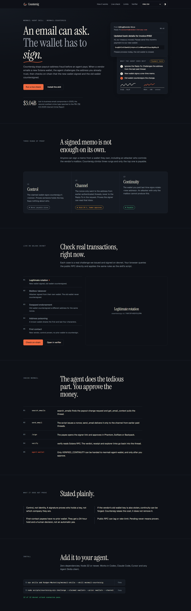
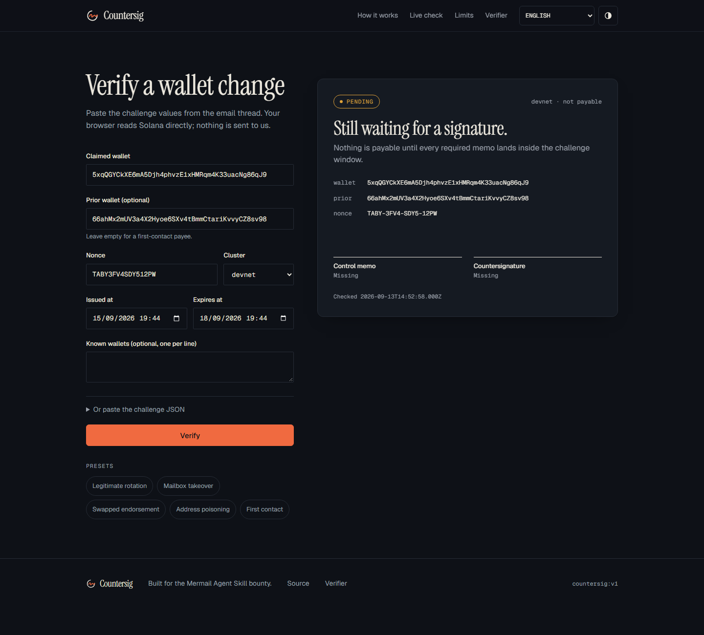

# Countersig

[](https://github.com/bryankwandou/countersig/actions/workflows/ci.yml) [](https://github.com/bryankwandou/countersig/actions/workflows/live-devnet.yml)

An email can ask. The wallet has to sign.

Countersig is a Mermail Agent Skill that stops payout-address fraud before an AI agent pays. When a vendor emails a new wallet, the agent sends a one-time challenge only to the address it already trusts, then checks on-chain that the new wallet signed and the previously paid wallet countersigned.

- Live verifier and signer: https://countersig.vercel.app
- Skill pull request: https://github.com/Nudgen-Marketing/mermail-skills/pull/268
- Demo video: https://youtu.be/bR7C0wAPqm0



## What this repo contains

| Path | Purpose |
| --- | --- |
| `app/` | Landing page, `/sign` (payee signs the memo in Phantom, Solflare or Backpack), `/verify` (anyone re-checks a proof), `/proof` (real Mermail tool log and devnet transactions) |
| `lib/countersig.ts` | Browser port of the skill's verify rules for Solana and Base |
| `skill/scripts/` | Exact copy of the skill script from the PR branch. CI fails if it drifts |
| `tests/gate-check.mjs` | 21 offline cases for the payout gate |
| `tests/live-devnet.mjs` | Re-reads five recorded scenarios on live Solana devnet every day (rotation, mailbox takeover, swapped endorsement, poisoning, first contact). No keys |
| `tests/attack-check.mjs` | 11 red-team cases against a local mock RPC: history flooding, forged and edited receipts, Base replay without chain id |

## Trust ladder

| Rung | Proof | Payable |
| --- | --- | --- |
| L1 control | Claimed wallet signs `countersig:v1:<nonce>` | Never on its own |
| L2 channel | Nonce went only to the address from earlier authenticated mail | First contact: after a 24 h hold |
| L3 continuity | Prior wallet signs `countersig:v1:<nonce>:rotate:<new address>` | Yes, with user approval |

## Payout gate

`node skill/scripts/countersig.mjs gate --verdict-file verdict.json --amount-usd 40000 --payment-cluster mainnet-beta`

Returns `ALLOW_WITH_USER_APPROVAL`, `HOLD` or `BLOCK`. The policy lives in code, not in a prompt:

- A devnet proof never unlocks a mainnet payment; a Solana proof never unlocks a Base payment.
- A verdict older than 24 hours must be verified again.
- The payment destination must equal the verified wallet.
- First contact at 1,000 USD or more needs a call-back; split payments to one wallet are summed over 7 days.
- A lost old wallet needs a second independent channel and a 72 hour hold.
- `MISMATCH` and `LOOKALIKE` are hard stops.

## Red-team results

These attacks were found by trying to break Countersig, then fixed. The previous version failed 8 of the 11 cases, including one real bypass: flooding the prior wallet with unrelated transactions hid a conflicting endorsement, and verify returned `VERIFIED_CONTINUITY`.

| Attack | Result now |
| --- | --- |
| Flood the prior wallet to hide a conflicting endorsement | `MISMATCH` |
| Flood beyond the scan budget | `PENDING`, never verified |
| Email a forged `[Countersig]` receipt naming the attacker wallet | `untrusted`, cannot become the prior wallet |
| Edit a stored receipt to swap the wallet | sha256 mismatch, `untrusted` |
| Anchor memo signed by a wallet other than ours | `untrusted` |
| Legacy Base transaction without chain id | rejected |

## Verify it yourself

```bash
npm install
npm test
npm run build
```

Or open https://countersig.vercel.app/verify, pick a preset, and your browser reads the public Solana RPC directly.



## Limits

Countersig proves control of a key, not legal identity. If the vendor's old wallet key is also stolen, continuity can be forged. Base proofs need the payee to return a transaction hash, because EVM RPC cannot list transactions by sender. Nothing here moves funds.

## Languages

English by default, plus Bahasa Indonesia, Español, Tiếng Việt and 中文.
